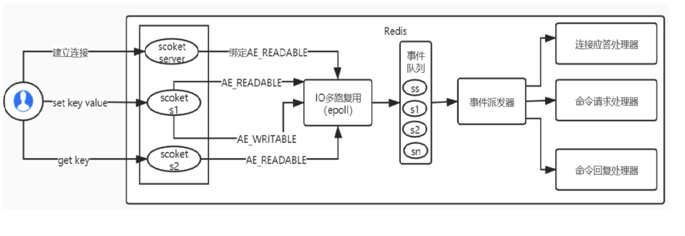

## redis网络架构

Redis使用epoll来实现IO多路复用，**将连接信息和事件放到队列中**，一次放到文件事**件分派器**中，事件分派器将事件分发给**事件处理器**

注意：**IO多路复用是一种思想**，这种思想在linux系统里面的落地实现是select、poll、epoll。

redis是单线程，如果使用阻塞IO的话会是一个什么情况呢？在等待用户输入的时候会**一直等直到读完**，数据回写时会**一直阻塞等待写完**，这些**等待的时间都不能够对外提供服务**，在其他客户端看来服务器就好像卡死了一样无法提供服务，而IO多路复用就是为了解决这个问题

所谓的IO多路复用机制就是通过一种手段，**可以监听多个描述符，一但某个描述符准备就绪，能够通知程序进行相应的处理**。这种机制需要select、poll、epoll来配合。多个连接共用一个阻塞对象，**应用程序只需要在这一个阻塞对象上等待**，无需阻塞等待所有连接，当某条连接有新数据可以处理的时候，**操作系统通知应用程序**，线程从阻塞状态返回，开始进行业务处理。

redis服务基于Reactor模型来实现网络事件处理器，他由四个部分组成：

多个套接字（多个连接）、IO多路复用程序（epoll）、文件事件分派器（单线程的）、事件处理器。因为文件事件分派器分派事件是单线程的（这个地方可以搞多线程去消费，那么就不是单线程了），所以redis才叫单线程模型